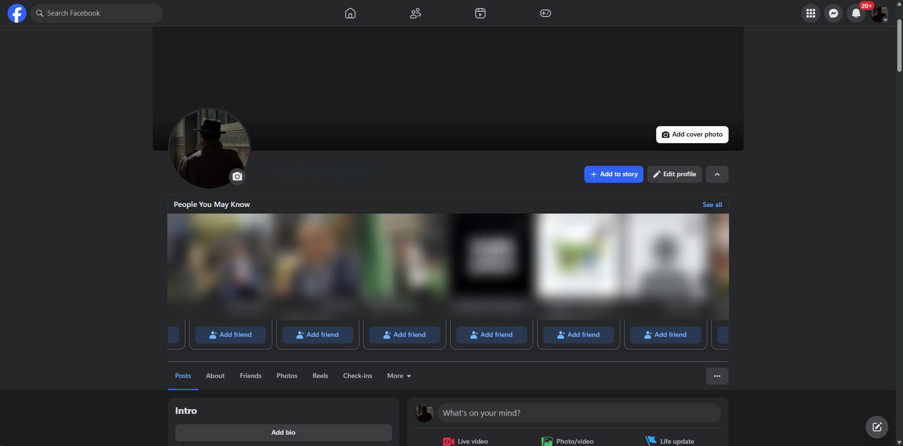
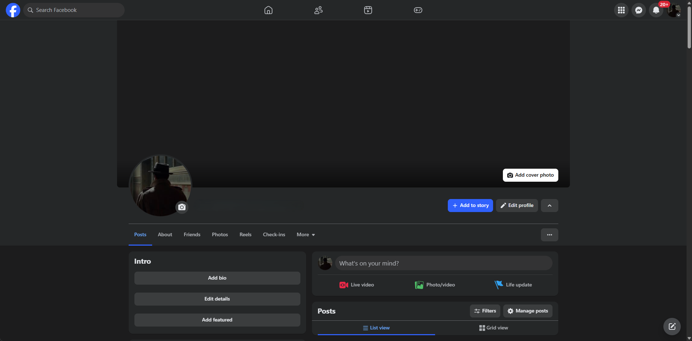

  

  # إخفاء "أشخاص قد تعرفهم" (Hide 'People You May Know')

  

  إضافة بسيطة للمتصفح لإخفاء قسم "أشخاص قد تعرفهم" (People You May Know) في فيسبوك.

  [**عربي**](README_AR.md) | [**English**](README.md)

---

## المميزات

- **تصفح أنظف:** يخفي أقسام "أشخاص قد تعرفهم" تلقائيًا من "آخر الأخبار" (Feed) والملف الشخصي.
- **دعم ثنائي اللغة:** يدعم واجهة فيسبوك باللغتين العربية والإنجليزية.
- **خفيفة وسريعة:** إضافة فعالة لا تستهلك موارد الجهاز ولا تبطئ التصفح.
- **تخطيط متناسق:** تقوم بإزالة الحاويات الفارغة بذكاء لمنع ظهور مساحات بيضاء غير ضرورية.

## صور توضيحية

| قبل التفعيل | بعد التفعيل |
|:---:|:---:|
|  |  |

## التثبيت

### لمتصفحات كروم / إيدج / بريف (Chromium Browsers)

1. **قم بتنزيل ملف ZIP** للإصدار الأخير من صفحة [الإصدارات (Releases)](../../releases/latest).
2. **فك الضغط** عن الملف في مجلد على جهازك.
3. افتح المتصفح وانتقل إلى صفحة الإضافات عبر الرابط: `chrome://extensions`.
4. قم بتفعيل **وضع المطور (Developer mode)** في الزاوية العلوية (اليسرى أو اليمنى حسب لغة المتصفح).
5. اضغط على زر **تحميل إضافة غير محزمة (Load unpacked)**.
6. اختر المجلد الذي قمت بفك الضغط عنه (الذي يحتوي على ملف `manifest.json`).

## كيف تعمل الإضافة

تقوم الإضافة بالبحث في صفحة فيسبوك عن العناوين التي تحتوي على "أشخاص قد تعرفهم". عند العثور عليها، تقوم بإخفاء البطاقة بالكامل. تستخدم الإضافة تقنية `MutationObserver` لمراقبة الصفحة باستمرار، مما يضمن إخفاء الأقسام الجديدة التي تظهر أثناء التمرير لأسفل.
